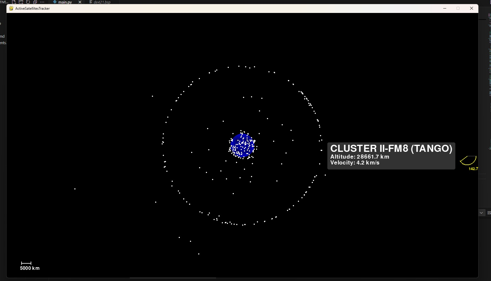

 Features:
- Real-time satellite tracking.
- High-resolution 3D-like Earth visualization.
- Interactive zoom (mouse wheel) and pan (left-click drag).
- Hover for satellite details (name, altitude, velocity, inclination).
- Proportional distance scale (5000 km).

 Requirements:
- Python 3.11 or 3.13
- Libraries: pygame, requests, skyfield, matplotlib 

Installation: Clone or download main.py to ActiveSatellitesTracker directory.

Install dependencies:

	cd ActiveSatellitesTracker
	pip install requests skyfield pygame

Run:

	python main.py

 Usage:
- Zoom with mouse wheel, pan by dragging left-click.
- Hover over satellites (white dots) for info.
- Press Esc or close the 1600x900 window to exit.

Thanks to Celestrak, Skyfield, Pygame, and the open-source community.
